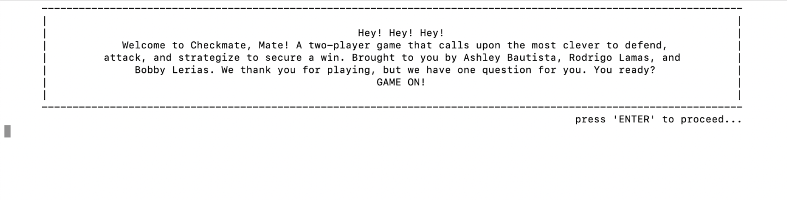
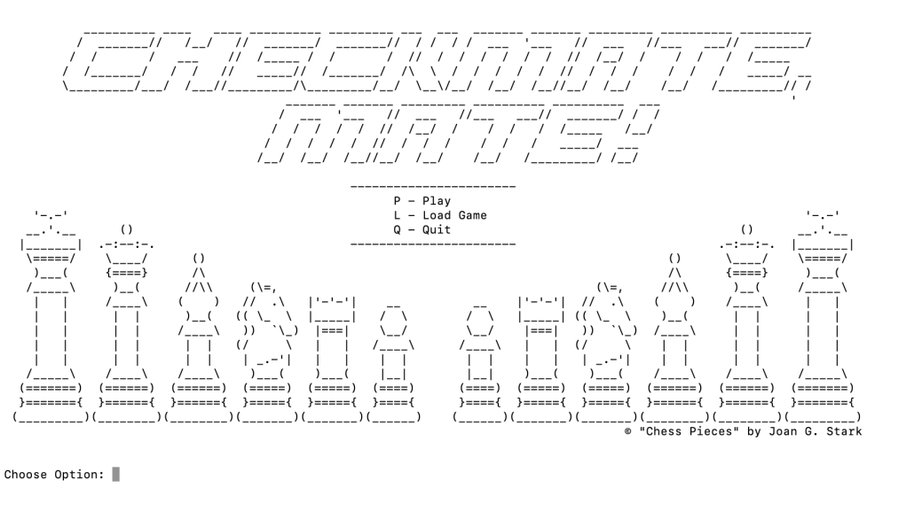
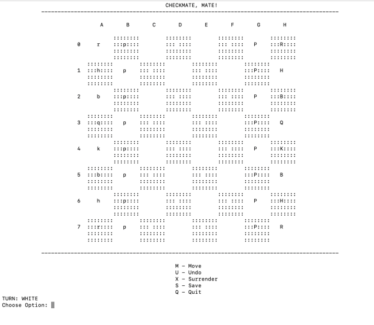
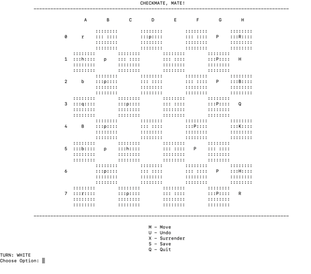
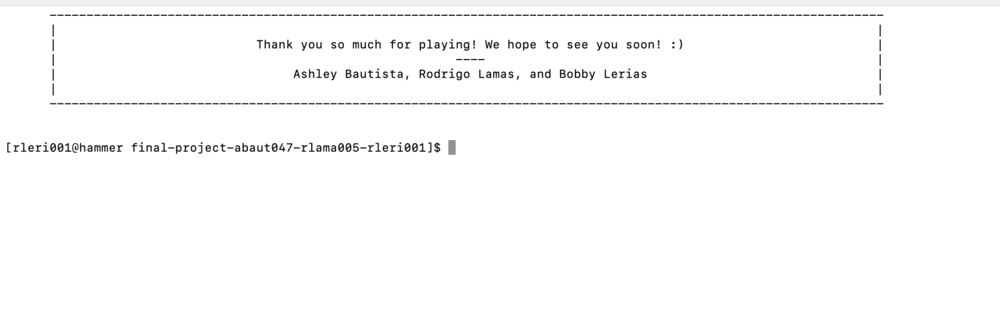

 # Checkmate, Mate!
 
 > Authors: [Ashley Bautista](https://github.com/ashley-bautista),
  [Rodrigo Lamas](https://github.com/lb-rodrigo),
  [Bobby Lerias](https://github.com/bobbyyy57)
 
## Project Description
**Importance/Interesting**:
 * All watching The Queen’s Gambit, out of the list of ideas in the project description, the Chess Game easily caught all of our attention. How complex and yet-so simple chess is, the possibilities of what we can do as a team drove us to choose this project. Even though each of us have had experience playing chess, the game itself and the world that possess it is so foreign. We saw an opportunity to dive deep into chess and understand its complexities all while applying technical skills we have obtained in class. 

**Languages/Tool**s:
 * *C++*
 * *VSCode*: source-code editor made by Microsoft for Linux, Windows, and macOS.
 * *Repl.It*: online IDE that stands for “read--evaluate--print loop”.
 
**Input/Output**:
 * *Input*:
   * the amount of players (one or two) which decides if the player will be playing against a computer or not
   * user's moves
   * 'q' = 'quit'
   * 'r' = 'redo'
   * 's' = 'save'
 * *Output*:
   * depending on amount of players, game will start with either two-players or against computer 
   * the pieces moving from one spot (node) to another by either a user of the computer.
   * quits the game
   * redos player's move
   * saves game and will allow player(s) to return to game
 
**Design Patterns**:
 * *Strategy Pattern*: This design pattern is a useful pattern in which we can change class behavior or algorithm at run time. In this pattern, we are meant to create an object whose behavior is dependent on the strategy it is applied to. There are several different objects representing these strategies. In our project in particular, we have seven different strategies, each representing the different types of buttons the user will have access to. This design allows us to organize our buttons according to the user's input. 
 * *Factory Method Pattern*: This design pattern allows us to design an interface that will create objects in a superclass that allows subclasses to alter the type that will be created. We will find this pattern useful for the implementation of our Piece class. The Creator will be the Piece Factory in which will have several derived factories for each type of chess piece serving as the Concrete Creators. The Product will be the Piece class itself in which will have several derived classes as well that will determine if the move is valid or not. These classes will be the Concrete Products. This design will allow us better organization or our various Piece class. 

## Class Diagram
 *Strategy Design Pattern*: The functionality of the strategy design pattern shines by allowing us to define a family of algorithms, putting each of them into a separate class while make their objects interchangeable at run time. This is very beneficial as we are able to use pure virtual functions to define algorithms while we allow each indivdual button to implement their algorithm.

 *Factory Method Pattern*: The functionality of the abstract factory pattern can be portrayed by its ability to create objects without having to specify the exact class ofthe object that will be created. This allows us to explicitly declare interfaces for each distinct product of the Piece family without having them to specifically be dependent on the buiness logic of the interface.

## Program Running

